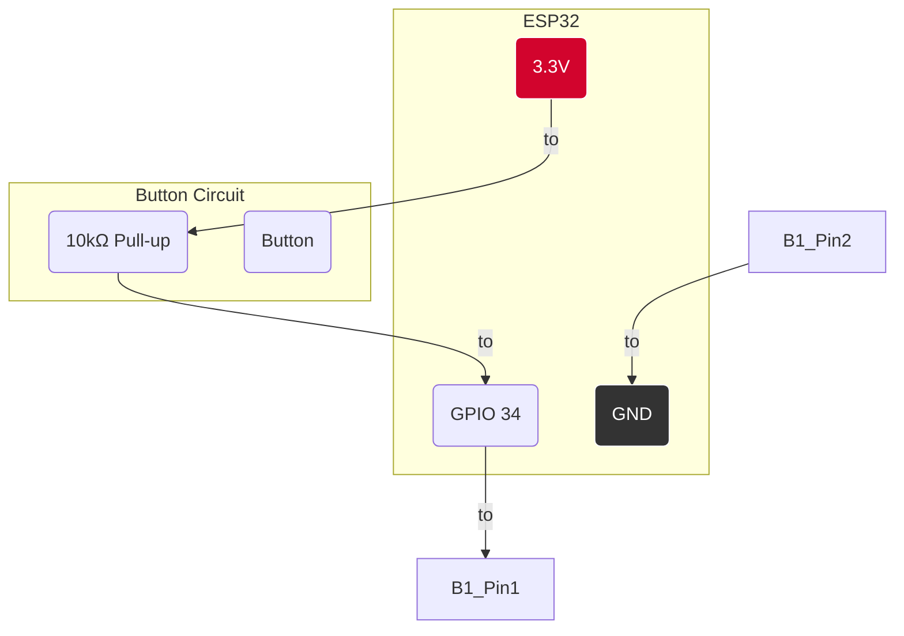

# 🔘 მოდული: `button_input`

**🗂️ კატეგორია:** `drivers`  
**✒️ ავტორი:** Giorgi Magradze & Synapse AI Expert  
**🔖 ვერსია:** 1.0.0

## 1. 📜 მიმოხილვა

`button_input` არის Synapse Framework-ის **მომხმარებლის შეტანის (User Input) ფუნდამენტური მოდული**. ის უზრუნველყოფს მარტივ, საიმედო და მოქნილ მექანიზმს აპარატურული, ტაქტილური ღილაკების დასამუშავებლად.

მოდულის მთავარი ამოცანაა, დააფიქსიროს ღილაკზე დაჭერა GPIO შეფერხებების (Interrupts) გამოყენებით, მოახდინოს სიგნალის "გაწმენდა" (Debouncing) და შემდეგ, `Event Bus`-ზე გამოაქვეყნოს სტანდარტული `FMW_EVENT_BUTTON_PRESSED` ივენთი. ეს საშუალებას აძლევს სისტემის ნებისმიერ სხვა ნაწილს (მაგ., `ssd1 ઉ6_oled_display`), რეაგირება მოახდინოს მომხმარებლის ფიზიკურ ინტერაქციაზე ისე, რომ არ იყოს პირდაპირ დამოკიდებული აპარატურულ დეტალებზე.

## 2. 🏛️ არქიტექტურული პრინციპები

- **Event Producer:** 📢 მოდული არის სუფთა "ივენთების მწარმოებელი". მისი ერთადერთი გამომავალი პროდუქტი არის `FMW_EVENT_BUTTON_PRESSED` ივენთი.
- **შეფერხებებზე დაფუძნებული:** ⚡️ მაქსიმალური ეფექტურობისთვის, მოდული იყენებს GPIO ISR-ებს (Interrupt Service Routines) ღილაკის დაჭერის მომენტის დასაფიქსირებლად.
- **ასინქრონული დამუშავება:** 🔄 ISR-ი არის უკიდურესად სწრაფი — ის მხოლოდ აგზავნის შეტყობინებას FreeRTOS რიგში. ყველა "მძიმე" სამუშაო, მათ შორის Debouncing და ივენთის გამოქვეყნება, სრულდება გამოყოფილ, დაბალი პრიორიტეტის ტასკში.
- **Debouncing:** 🛡️ ჩაშენებული აქვს მარტივი, დროზე დაფუძნებული Debouncing მექანიზმი, რათა თავიდან ავიცილოთ ღილაკის ერთი დაჭერის მრავალჯერად სიგნალად აღქმა.
- **მოქნილი კონფიგურაცია:** ⚙️ მოდული სრულად კონფიგურირებადია `config.json`-ის საშუალებით, რაც იძლევა ნებისმიერი რაოდენობის ღილაკის, ნებისმიერ GPIO პინზე მიერთების საშუალებას.

## 3. ⚙️ კონფიგურაცია (`config.json`)

მოდულის კონფიგურაცია ხდება `buttons` მასივის საშუალებით, სადაც თითოეული ობიექტი აღწერს ერთ ღილაკს.

**კონფიგურაციის მაგალითი:**

```json
[
  {
    "type": "button_input",
    "enabled": true,
    "config": {
      "instance_name": "main_buttons",
      "buttons": [
        {
          "name": "UP",
          "gpio_pin": 34,
          "active_level": 0
        },
        {
          "name": "DOWN",
          "gpio_pin": 35,
          "active_level": 0
        },
        {
          "name": "OK",
          "gpio_pin": 32,
          "active_level": 0
        }
      ]
    }
  }
]
```

**`buttons` ობიექტის პარამეტრები:**

| პარამეტრი | ტიპი | აღწერა | სავალდებულო |
| :--- | :--- | :--- | :---: |
| `name` | სტრიქონი | ღილაკის უნიკალური სახელი (მაგ., "UP", "OK"). ეს სახელი გაიგზავნება ივენთის `payload`-ში. | ✅ |
| `gpio_pin` | რიცხვი | GPIO პინის ნომერი, რომელზეც ღილაკია მიერთებული. | ✅ |
| `active_level` | რიცხვი | ლოგიკური დონე, რომელიც დაჭერილ მდგომარეობად ითვლება. `0` = Active-Low (pull-up), `1` = Active-High (pull-down). | ❌ (Default: `0`) |

## 4. 📢 გამოქვეყნებული ივენთი

- **ივენთის სახელი:** `FMW_EVENT_BUTTON_PRESSED`
- **Payload-ის ტიპი:** `fmw_button_payload_t`
- **Payload-ის შიგთავსი (მაგალითი):**

  ```c
  // fmw_button_payload_t payload;
  // payload.button_name = "UP";
  ```

## 5. 🔌 მიერთების სქემა

მოდული შექმნილია **შიდა Pull-up რეზისტორების** გამოყენებით (`active_level: 0` რეჟიმში). ღილაკი უნდა შეერთდეს შემდეგნაირად:

- **ერთი ფეხი:** ESP32-ის **GND** პინზე.
- **მეორე ფეხი:** ESP32-ის შესაბამის **GPIO** პინზე.

**ყურადღება:** ESP32-ის ზოგიერთ პინს (მაგ., GPIO 34, 35) არ გააჩნია შიდა pull-up/pull-down რეზისტორები. ამ პინების გამოყენებისას, აუცილებელია **გარე 10kΩ Pull-up რეზისტორის** დამატება GPIO პინსა და 3.3V-ს შორის.



დიაგრამა ასახავს გარე Pull-up რეზისტორის გამოყენებას GPIO 34-ისთვის.
