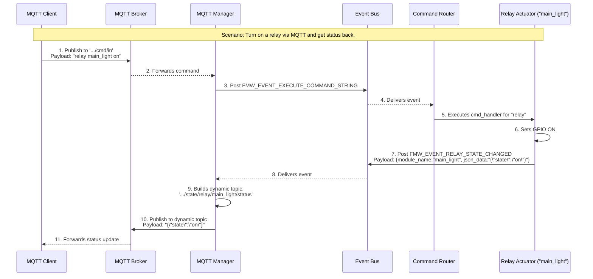

# კომუნიკაციის პატერნების წესები

## ძირითადი პრინციპი: მაქსიმალური იზოლაცია

**FUNDAMENTAL RULE:** Synapse ESP Framework-ში უნდა შენარჩუნდეს მაქსიმალური იზოლაცია მოდულებს შორის.

## სამი ძირითადი პატერნი

### 1. Service Locator Pattern

- **გამოიყენება:** პირდაპირი, სინქრონული API გამოძახებებისთვის.
- **როდის ვიყენებთ:**
  - როდესაც ერთ მოდულს სჭირდება მეორე მოდულის კონკრეტული ფუნქციის **დაუყოვნებლივ** გამოძახება.
  - მაგალითად: `ota_manager`-ს სჭირდება `rgb_led_indicator`-ის ფერის შეცვლა.
- **მაგალითი:**

    ```c
    // MQTT module calls display API directly
    service_handle_t display_service_handle = fmw_service_get("main_display");
    if (display_service_handle) {
        ssd1306_api_t *ssd1306_service_api = (ssd1306_api_t *)display_service_handle;
        ssd1306_service_api->disable();
    }
    ```

### 2. Event Bus Pattern

- **გამოიყენება:** ასინქრონული, "გამოაქვეყნე-გამოიწერე" (Publish/Subscribe) სცენარებისთვის.
- **როდის ვიყენებთ:**
  - როდესაც ინფორმაცია უნდა მიეწოდოს **ერთ ან მეტ** (პოტენციურად არცერთ) მსმენელს.
  - როდესაც გამომგზავნმა არ "იცის" და არ უნდა იცოდეს, ვინ მიიღებს ინფორმაციას.
  - მაგალითად: სენსორი აქვეყნებს მონაცემებს, რომელსაც შეიძლება უსმენდეს `logger`, `mqtt_manager` და `sensor_aggregator`.
- **მაგალითი:**

    ```c
    // DHT22 publishes data for multiple consumers
    telemetry_data_t sensor_telemetry_data = {
        .temperature = 23.5,
        .humidity = 65.2
    };
    fmw_event_bus_post("SENSOR_DATA_TEMPERATURE", wrapper);
    ```

### 3. Command Router Pattern (ახალი სექცია)

- **გამოიყენება:** მომხმარებლის მიერ ინიცირებული, ტექსტური ბრძანებების ცენტრალიზებული მართვისთვის.
- **როდის ვიყენებთ:**
  - როდესაც ფუნქციონალი უნდა იყოს ხელმისაწვდომი ნებისმიერი ინტერფეისიდან (Serial, MQTT, HTTP).
  - როდესაც გვჭირდება ერთიანი `help` სისტემა და არგუმენტების პარსინგი.
- **პატერნის აღწერა:**
    1. მოდული, რომელსაც სურს, ჰქონდეს CLI ბრძანება, იყენებს `Command Router`-ის Service API-ს.
    2. ის ამოწმებს, არის თუ არა სასურველი ბრძანება (`"relay"`, `"wifi"`) უკვე რეგისტრირებული `is_command_registered` ფუნქციით.
    3. **თუ ბრძანება არ არის რეგისტრირებული**, ის არეგისტრირებს მას და აწვდის ზოგად `handler` ფუნქციას.
    4. ეს `handler` ფუნქცია იღებს არგუმენტებს (მაგ., `instance_name`) და `Service Locator`-ის მეშვეობით პოულობს და მართავს კონკრეტულ ინსტანციას.
- **მაგალითი (`relay_actuator.c`-დან):**

    ```c
    // FMW_SYSTEM_START_COMPLETE ივენთის მიღებისას
    cmd_router_api_t *cmd_api = (cmd_router_api_t *)fmw_service_get("main_cmd_router");
    if (cmd_api && !cmd_api->is_command_registered("relay")) {
        static cmd_t relay_cmd = {
            .command = "relay",
            .handler = generic_relay_cmd_handler,
            // ...
        };
        cmd_api->register_command(&relay_cmd);
    }
    ```

## კომუნიკაციის ტიპები

### Direct API Communication (Service Locator)

```
[MQTT Module] --API call--> [Display Module]
              --API call--> [Relay Module]
              --API call--> [System Module]
```

**Implementation:**

```c
// Display module registers API
fmw_service_register("main_display", FMW_SERVICE_TYPE_DISPLAY_API, &ssd1306_service_api);

// MQTT module uses API
service_handle_t display_service_handle = fmw_service_get("main_display");
fmw_service_type_t type;
if (display_service_handle && fmw_service_get_type("main_display", &type) == ESP_OK && type == FMW_SERVICE_TYPE_DISPLAY_API) {
    ssd1306_api_t *ssd1306_service_api = (ssd1306_api_t *)display_service_handle;
    ssd1306_service_api->enable();
}
```

### Broadcast Communication (Event Bus)

```
[DHT22 Sensor] --event--> [Event Bus] --event--> [MQTT Module]
                                    --event--> [Display Module]
                                    --event--> [Logger Module]
```

**Implementation:**

```c
// Sensor publishes data
telemetry_data_t sensor_telemetry_data = { .temperature = 23.5 };
event_data_wrapper_t* wrapper;
fmw_event_data_wrap(&sensor_telemetry_data, NULL, &wrapper);
fmw_event_bus_post("TELEMETRY_EVENT_SENSOR_DATA", wrapper);
fmw_event_data_release(wrapper);

// Multiple modules subscribe
fmw_event_bus_subscribe("TELEMETRY_EVENT_SENSOR_DATA", mqtt_module_instance);
fmw_event_bus_subscribe("TELEMETRY_EVENT_SENSOR_DATA", display_module_instance);
```

## აკრძალული პატერნები

### ❌ პირდაპირი დამოკიდებულებები

```c
// NEVER DO THIS
#include "ssd1306_module.h"  // Direct dependency! Violates isolation!
#include "relay_module.h"    // Violates isolation!

// In MQTT module
ssd1306_api_enable();  // Direct function call - BAD!
```

### ❌ პატერნების არასწორი შერევა

```c
// DON'T MIX - choose one pattern per use case
// Wrong: using both Event Bus AND Service Locator for the same purpose
fmw_event_bus_post("DISPLAY_ENABLE_EVENT", NULL);  // Event Bus
display_api->enable();                       // Service Locator
```

### ❌ System Manager MQTT Handling

```c
// NEVER DO THIS - System Manager must not handle MQTT
static void system_manager_handle_event(module_t *module, const char *event_name, void *event_data) {
    if (strcmp(event_name, "MQTT_EVENT_COMMAND_RECEIVED") == 0) {  // FORBIDDEN!
        // System Manager should NEVER handle MQTT commands
    }
}
```

## სწორი იმპლემენტაცია

### Service Locator-ის გამოყენება

#### 1. Service Registration (Display Module)

```c
// ssd1306_module.c
static ssd1306_api_t ssd1306_service_api = {
    .enable = ssd1306_api_enable,
    .disable = ssd1306_api_disable,
    .clear = ssd1306_api_clear,
    .write_text = ssd1306_api_write_text
};

module_t *ssd1306_module_create(const cJSON *config) {
    // ... module creation ...
    // Register API in Service Locator
    esp_err_t operation_result = fmw_service_register(module->name, FMW_SERVICE_TYPE_DISPLAY_API, &ssd1306_service_api);
    if (operation_result != ESP_OK) {
        ESP_LOGE(TAG, "Failed to register service API");
        // ... cleanup ...
        return NULL;
    }
    return module;
}
```

#### 2. Service Usage (MQTT Module)

```c
// mqtt_module.c - NO direct includes of other modules!
static esp_err_t handle_display_command(const char *module_instance_name, const char *action) {
    service_handle_t display_service_handle = fmw_service_get(module_instance_name);
    if (!display_service_handle) {
        ESP_LOGW(TAG, "Service not found: %s", module_instance_name);
        return ESP_ERR_NOT_FOUND;
    }
    
    fmw_service_type_t service_type;
    if (fmw_service_get_type(module_instance_name, &service_type) != ESP_OK || service_type != FMW_SERVICE_TYPE_DISPLAY_API) {
        ESP_LOGW(TAG, "Invalid service type for %s", module_instance_name);
        return ESP_ERR_INVALID_ARG;
    }

    ssd1306_api_t *ssd1306_service_api = (ssd1306_api_t *)display_service_handle;
    if (strcmp(action, "enable") == 0) {
        return ssd1306_service_api->enable();
    } else if (strcmp(action, "disable") == 0) {
        return ssd1306_service_api->disable();
    }
    return ESP_ERR_INVALID_ARG;
}
```

### Event Bus-ის გამოყენება

#### 1. Event Publishing (Sensor Module)

```c
// dht22_module.c
static esp_err_t publish_sensor_reading(dht22_private_data_t *dht22_data, float temperature, float humidity) {
    // ... create payload ...
    event_data_wrapper_t *wrapper;
    fmw_event_data_wrap(payload, free_payload_fn, &wrapper);
    esp_err_t err = fmw_event_bus_post("TELEMETRY_EVENT_SENSOR_DATA", wrapper);
    fmw_event_data_release(wrapper);
    return err;
}
```

#### 2. Event Subscription (MQTT Module)

```c
// mqtt_module.c
static void mqtt_handle_event(module_t *module, const char *event_name, void *event_data) {
    if (strcmp(event_name, "TELEMETRY_EVENT_SENSOR_DATA") == 0) {
        event_data_wrapper_t* wrapper = (event_data_wrapper_t*)event_data;
        telemetry_data_t *data = (telemetry_data_t *)wrapper->payload;
        
        // ... Build MQTT topic and publish ...
    }
    
    if (event_data) {
        fmw_event_data_release((event_data_wrapper_t*)event_data);
    }
}
```

## დინამიური MQTT თემები `{module_name}` Placeholder-ით

`mqtt_manager` მოდული მხარს უჭერს დინამიური თემების გენერაციას, რაც განსაკუთრებით სასარგებლოა, როდესაც სისტემაში გვაქვს ერთი ტიპის რამდენიმე მოწყობილობა (მაგ., რამდენიმე რელე).

### პატერნის აღწერა

1. **`module.json`:** მოდული, რომლის სტატუსის გამოქვეყნებაც გვინდა (მაგ., `relay_actuator`), თავის `module.json`-ში, `mqtt_interface`-ის `publishes` სექციაში, განსაზღვრავს თემის შაბლონს, რომელიც შეიცავს `{module_name}` placeholder-ს.

    ```json
    "publishes": {
        "state_changed": "state/relay/{module_name}/status"
    }
    ```

2. **ივენთის Payload:** როდესაც ეს მოდული აქვეყნებს ივენთს (`FMW_EVENT_RELAY_STATE_CHANGED`), ის `fmw_telemetry_payload_t` სტრუქტურის `module_name` ველში სვამს თავის უნიკალურ `instance_name`-ს (მაგ., `"main_light"`).
3. **`mqtt_manager`-ის ლოგიკა:** `mqtt_manager` იღებს ამ ივენთს, ხედავს, რომ თემის შაბლონი შეიცავს `{module_name}`-ს, და ცვლის ამ placeholder-ს `payload`-იდან მოსული კონკრეტული სახელით.
4. **საბოლოო თემა:** შედეგად, იქმნება უნიკალური თემა თითოეული ინსტანციისთვის, მაგ., `.../state/relay/main_light/status`.

ეს პატერნი უზრუნველყოფს მაქსიმალურ მოქნილობას და გამორიცხავს `mqtt_manager`-ში `hardcoded` ლოგიკის საჭიროებას.

## პატერნის არჩევის გზამკვლევი

### Service Locator-ის გამოყენება

✅ **`ota_manager` → `rgb_led_indicator` `set_color`**
✅ **`wifi_manager` → `storage_manager` `set_string`**
✅ **ნებისმიერი პირდაპირი, სინქრონული API გამოძახება**

### Event Bus-ის გამოყენება

✅ **`dht22_sensor` → `logger`, `mqtt_manager`, `aggregator`**
✅ **`wifi_manager` → `WIFI_EVENT_CONNECTED` (სისტემური შეტყობინება)**
✅ **`system_timer` → ნებისმიერი დაგეგმილი მოქმედება**
✅ **ნებისმიერი ასინქრონული, "ერთი-მრავალთან" სცენარი**

## Architecture Diagram



```bash
┌─────────────────┐    Service Locator     ┌─────────────────┐
│   MQTT Module   │ ────────────────────► │ Display Modules │
└─────────────────┘    (Direct API)       └─────────────────┘
         │
         │ Event Bus
         │ (Broadcast)
         ▼
┌─────────────────┐                       ┌─────────────────┐
│   Event Bus     │ ◄──────────────────── │ Sensor Modules  │
└─────────────────┘                       └─────────────────┘
         │
         │ Event Bus
         │ (Broadcast)
         ▼
┌─────────────────┐
│ Logger Module   │
└─────────────────┘
```

## შეჯამება

1. **Service Locator** = პირდაპირი API გამოძახებები იზოლაციით.
2. **Event Bus** = broadcast ივენთები სრული დეკაპლინგით.
3. **Command Router** = ტექსტური ბრძანებების ცენტრალიზებული მართვა.
4. **არასდროს** შექმნათ პირდაპირი დამოკიდებულებები მოდულებს შორის.
5. ყოველთვის აირჩიეთ სწორი ინსტრუმენტი კონკრეტული ამოცანისთვის.
