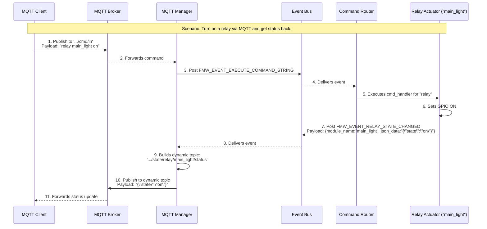

# კომუნიკაციის პატერნების წესები

## ძირითადი პრინციპი: მაქსიმალური იზოლაცია

**FUNDAMENTAL RULE:** Synapse ESP Framework-ში უნდა შენარჩუნდეს მაქსიმალური იზოლაცია მოდულებს შორის.

## ორი კომუნიკაციის პატერნი

### 1. Service Locator Pattern

**გამოიყენება:** პირდაპირი API calls-ისთვის

**როდის ვიყენებთ:**

- MQTT module-მა უნდა გამოიძახოს display-ის enable/disable
- System Manager-მა უნდა მიიღოს I2C handle
- Module-მა უნდა მიიღოს კონკრეტული service-ის API

**მაგალითი:**

```c
// MQTT module calls display API directly
service_handle_t display_service_handle = fmw_service_get("main_display");
if (display_service_handle) {
    ssd1306_api_t *ssd1306_service_api = (ssd1306_api_t *)display_service_handle;
    ssd1306_service_api->disable();
}
```

### 2. Event Bus Pattern

**გამოიყენება:** broadcast/notification scenarios-ისთვის

**როდის ვიყენებთ:**

- Sensor data-ს რამდენიმე module უნდა მიიღოს
- System-wide notification-ები (shutdown, restart)
- Multiple modules-მა უნდა იმოქმედოს ერთი event-ზე

**მაგალითი:**

```c
// DHT22 publishes data for multiple consumers
telemetry_data_t sensor_telemetry_data = {
    .temperature = 23.5,
    .humidity = 65.2
};
event_bus_post(TELEMETRY_EVENT_SENSOR_DATA, &sensor_telemetry_data);
```

## კომუნიკაციის ტიპები

### Direct API Communication (Service Locator)

```
[MQTT Module] --API call--> [Display Module]
              --API call--> [Relay Module]
              --API call--> [System Module]
```

**Implementation:**

```c
// Display module registers API
fmw_service_register("main_display", "display_api", &ssd1306_service_api);

// MQTT module uses API
service_handle_t display_service_handle = fmw_service_get("main_display");
if (display_service_handle && strcmp(fmw_service_get_type("main_display"), "display_api") == 0) {
    ssd1306_api_t *ssd1306_service_api = (ssd1306_api_t *)display_service_handle;
    ssd1306_service_api->enable();
}
```

### Broadcast Communication (Event Bus)

```
[DHT22 Sensor] --event--> [Event Bus] --event--> [MQTT Module]
                                    --event--> [Display Module]
                                    --event--> [Logger Module]
```

**Implementation:**

```c
// Sensor publishes data
telemetry_data_t sensor_telemetry_data = { .temperature = 23.5 };
event_bus_post(TELEMETRY_EVENT_SENSOR_DATA, &sensor_telemetry_data);

// Multiple modules subscribe
event_bus_subscribe(TELEMETRY_EVENT_SENSOR_DATA, mqtt_handle_sensor_data);
event_bus_subscribe(TELEMETRY_EVENT_SENSOR_DATA, display_handle_sensor_data);
```

## აკრძალული პატერნები

### ❌ პირდაპირი Dependencies

```c
// NEVER DO THIS
#include "ssd1306_module.h"  // Direct dependency!
#include "relay_module.h"    // Violates isolation!

// In MQTT module
ssd1306_api_enable();  // Direct function call - BAD!
```

### ❌ Mixed Patterns

```c
// DON'T MIX - choose one pattern per use case
// Wrong: using both Event Bus AND Service Locator for same purpose
event_bus_post(DISPLAY_ENABLE_EVENT, NULL);  // Event Bus
display_api->enable();                       // Service Locator
```

### ❌ System Manager MQTT Handling

```c
// NEVER DO THIS - System Manager must not handle MQTT
static void system_manager_handle_event(module_t *module, int32_t event_id, void *event_data) {
    if (event_id == MQTT_EVENT_COMMAND_RECEIVED) {  // FORBIDDEN!
        // System Manager should NEVER handle MQTT commands
    }
}
```

## სწორი იმპლემენტაცია

### Service Locator Usage

#### 1. Service Registration (Display Module)

```c
// ssd1306_module.c
static ssd1306_api_t ssd1306_service_api = {
    .enable = ssd1306_api_enable,
    .disable = ssd1306_api_disable,
    .clear = ssd1306_api_clear,
    .write_text = ssd1306_api_write_text
};

module_t *ssd1306_module_create(const cJSON *config) {
    // ... module creation ...
    // Register API in Service Locator
    esp_err_t operation_result = fmw_service_register(module_instance_name, "display_api", &ssd1306_service_api);
    if (operation_result != ESP_OK) {
        ESP_LOGE(TAG, "Failed to register service API");
        return NULL;
    }
    return module;
}
```

#### 2. Service Usage (MQTT Module)

```c
// mqtt_module.c - NO direct includes of other modules!
static esp_err_t handle_display_command(const char *module_instance_name, const char *action) {
    service_handle_t display_service_handle = fmw_service_get(module_instance_name);
    if (!display_service_handle) {
        ESP_LOGW(TAG, "Service not found: %s", module_instance_name);
        return ESP_ERR_NOT_FOUND;
    }
    const char *service_type = fmw_service_get_type(module_instance_name);
    if (!service_type || strcmp(service_type, "display_api") != 0) {
        ESP_LOGW(TAG, "Invalid service type for %s", module_instance_name);
        return ESP_ERR_INVALID_ARG;
    }
    ssd1306_api_t *ssd1306_service_api = (ssd1306_api_t *)display_service_handle;
    if (strcmp(action, "enable") == 0) {
        return ssd1306_service_api->enable();
    } else if (strcmp(action, "disable") == 0) {
        return ssd1306_service_api->disable();
    }
    return ESP_ERR_INVALID_ARG;
}
```

### Event Bus Usage

#### 1. Event Publishing (Sensor Module)

```c
// dht22_module.c
static esp_err_t publish_sensor_reading(dht22_private_data_t *dht22_data, float temperature, float humidity) {
    telemetry_data_t sensor_telemetry_data = {
        .sensor_type = SENSOR_TYPE_DHT22,
        .temperature = temperature,
        .humidity = humidity,
        .timestamp = esp_timer_get_time()
    };
    strncpy(telemetry.instance_name, p->instance_name, sizeof(telemetry.instance_name) - 1);
    return event_bus_post(TELEMETRY_EVENT_SENSOR_DATA, &telemetry);
}
```

#### 2. Event Subscription (MQTT Module)

```c
// mqtt_module.c
static void mqtt_handle_event(module_t *module, int32_t event_id, void *event_data) {
    if (event_id == TELEMETRY_EVENT_SENSOR_DATA) {
        telemetry_data_t *data = (telemetry_data_t *)event_data;
        
        // Build MQTT topic and publish
        char topic[128];
        snprintf(topic, sizeof(topic), "Synapse/v1/%s/data/%s", 
                 device_id, data->instance_name);
        
        // Create JSON payload
        cJSON *json = cJSON_CreateObject();
        cJSON_AddStringToObject(json, "sensor_type", "DHT22");
        cJSON_AddNumberToObject(json, "temperature", data->temperature);
        cJSON_AddNumberToObject(json, "humidity", data->humidity);
        
        char *payload = cJSON_Print(json);
        mqtt_publish(topic, payload);
        
        free(payload);
        cJSON_Delete(json);
    }
}
```

## დინამიური MQTT თემები `{module_name}` Placeholder-ით

`mqtt_manager` მოდული მხარს უჭერს დინამიური თემების გენერაციას, რაც განსაკუთრებით სასარგებლოა, როდესაც სისტემაში გვაქვს ერთი ტიპის რამდენიმე მოწყობილობა (მაგ., რამდენიმე რელე).

### პატერნის აღწერა

1. **`module.json`:** მოდული, რომლის სტატუსის გამოქვეყნებაც გვინდა (მაგ., `relay_actuator`), თავის `module.json`-ში, `mqtt_interface`-ის `publishes` სექციაში, განსაზღვრავს თემის შაბლონს, რომელიც შეიცავს `{module_name}` placeholder-ს.

    ```json
    "publishes": {
        "state_changed": "state/relay/{module_name}/status"
    }
    ```

2. **ივენთის Payload:** როდესაც ეს მოდული აქვეყნებს ივენთს (`FMW_EVENT_RELAY_STATE_CHANGED`), ის `fmw_telemetry_payload_t` სტრუქტურის `module_name` ველში სვამს თავის უნიკალურ `instance_name`-ს (მაგ., `"main_light"`).
3. **`mqtt_manager`-ის ლოგიკა:** `mqtt_manager` იღებს ამ ივენთს, ხედავს, რომ თემის შაბლონი შეიცავს `{module_name}`-ს, და ცვლის ამ placeholder-ს `payload`-იდან მოსული კონკრეტული სახელით.
4. **საბოლოო თემა:** შედეგად, იქმნება უნიკალური თემა თითოეული ინსტანციისთვის, მაგ., `.../state/relay/main_light/status`.

ეს პატერნი უზრუნველყოფს მაქსიმალურ მოქნილობას და გამორიცხავს `mqtt_manager`-ში `hardcoded` ლოგიკის საჭიროებას.

## პატერნის არჩევის გზამკვლევი

### Service Locator-ის გამოყენება

✅ **MQTT → Display enable/disable**
✅ **System Manager → I2C driver API**
✅ **Module → Configuration service**
✅ **Any direct API call between specific modules**

### Event Bus-ის გამოყენება

✅ **Sensor data → Multiple consumers (MQTT, Display, Logger)**
✅ **System notifications → All modules**
✅ **Framework events → Module lifecycle management**
✅ **Any broadcast scenario**

## Architecture Diagram



```bash
┌─────────────────┐    Service Locator     ┌─────────────────┐
│   MQTT Module   │ ────────────────────► │ Display Modules │
└─────────────────┘    (Direct API)       └─────────────────┘
         │
         │ Event Bus
         │ (Broadcast)
         ▼
┌─────────────────┐                       ┌─────────────────┐
│   Event Bus     │ ◄──────────────────── │ Sensor Modules  │
└─────────────────┘                       └─────────────────┘
         │
         │ Event Bus
         │ (Broadcast)
         ▼
┌─────────────────┐
│ Logger Module   │
└─────────────────┘
```

## შეჯამება

1. **Service Locator** = პირდაპირი API calls იზოლაციით
2. **Event Bus** = broadcast events decoupling-ით
3. **არასდროს** ნუ შევურევთ ამ პატერნებს
4. **არასდროს** ნუ შევქმნით პირდაპირ dependencies-ს მოდულებს შორის
5. **System Manager** არასდროს ნუ იყენებს MQTT-ს
6. ყოველთვის ავირჩიოთ სწორი ინსტრუმენტი კომუნიკაციის პატერნისთვის
