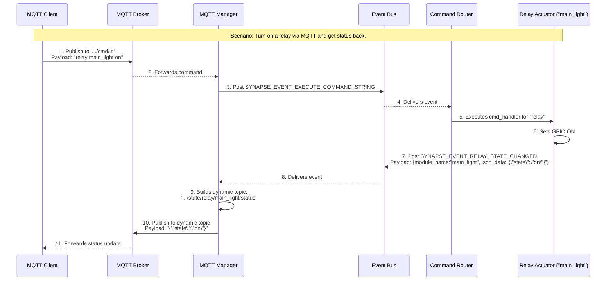

# კომუნიკაციის პატერნების წესები (v2.0)

## ძირითადი პრინციპი: მაქსიმალური იზოლაცია და პროგნოზირებადი გაშვება

**FUNDAMENTAL RULE:** Synapse ESP Framework-ში მოდულებს შორის უნდა შენარჩუნდეს მაქსიმალური იზოლაცია. ახალი, **State-Aware Service Locator**-ის წყალობით, ამას ემატება სისტემის პროგნოზირებადი და უსაფრთხო გაშვების გარანტია.

## ოთხი ძირითადი პატერნი

### 1. Service Locator Pattern (State-Aware)

- **გამოიყენება:** პირდაპირი, სინქრონული API გამოძახებებისთვის, **სერვისის მზადყოფნის გარანტიით.**
- **როდის ვიყენებთ:**
  - როდესაც ერთ მოდულს სჭირდება მეორე მოდულის კონკრეტული ფუნქციის გამოძახება.
  - ფრეიმვორქი (`System Manager`) უზრუნველყოფს, რომ მომხმარებელი მოდული არ დაიწყებს მუშაობას, სანამ მისი დამოკიდებულება (სერვისი) არ მიაღწევს `ACTIVE` სტატუსს.
- **პატერნის აღწერა:**
    1. **რეგისტრაცია (`_create` ფაზაში):** Service Provider მოდული თავის `_create` ფუნქციაში არეგისტრირებს სერვისს `synapse_service_register_with_status` ფუნქციით და საწყისი სტატუსით `SERVICE_STATUS_REGISTERED`.
    2. **სტატუსის მართვა (`System Manager`):** სისტემის გაშვებისას `System Manager` ავტომატურად ცვლის სერვისის სტატუსს:
        - `init`-ის დაწყებამდე -> `SERVICE_STATUS_INITIALIZING`
        - `start`-ის წარმატებით დასრულების შემდეგ -> `SERVICE_STATUS_ACTIVE`
        - შეცდომის შემთხვევაში -> `SERVICE_STATUS_ERROR`
    3. **გამოყენება (Dependency Injection):** Service Consumer მოდული იღებს სერვისის `handle`-ს `Dependency Injection`-ის მეშვეობით. მას არ სჭირდება სტატუსის შემოწმება, რადგან `System Manager`-მა უკვე უზრუნველყო სერვისის მზადყოფნა.

### 2. Event Bus Pattern

- **გამოიყენება:** ასინქრონული, "გამოაქვეყნე-გამოიწერე" (Publish/Subscribe) სცენარებისთვის.
- **როდის ვიყენებთ:**
  - როდესაც ინფორმაცია უნდა მიეწოდოს **ერთ ან მეტ** (პოტენციურად არცერთ) მსმენელს.
  - როდესაც გამომგზავნმა არ "იცის" და არ უნდა იცოდეს, ვინ მიიღებს ინფორმაციას.
  - მაგალითად: სენსორი აქვეყნებს მონაცემებს, რომელსაც შეიძლება უსმენდეს `logger`, `mqtt_manager` და `sensor_aggregator`.
- **მაგალითი:**

    ```c
    // DHT22 publishes data for multiple consumers
    telemetry_data_t sensor_telemetry_data = {
        .temperature = 23.5,
        .humidity = 65.2
    };
    synapse_event_bus_post("SENSOR_DATA_TEMPERATURE", wrapper);
    ```

### 3. Command Router Pattern

- **გამოიყენება:** მომხმარებლის მიერ ინიცირებული, ტექსტური ბრძანებების ცენტრალიზებული მართვისთვის.
- **როდის ვიყენებთ:**
  - როდესაც ფუნქციონალი უნდა იყოს ხელმისაწვდომი ნებისმიერი ინტერფეისიდან (Serial, MQTT, HTTP).
  - როდესაც გვჭირდება ერთიანი `help` სისტემა და არგუმენტების პარსინგი.
- **პატერნის აღწერა:**
    1. მოდული, რომელსაც სურს, ჰქონდეს CLI ბრძანება, იყენებს `Command Router`-ის Service API-ს.
    2. ის ამოწმებს, არის თუ არა სასურველი ბრძანება (`"relay"`, `"wifi"`) უკვე რეგისტრირებული `is_command_registered` ფუნქციით.
    3. **თუ ბრძანება არ არის რეგისტრირებული**, ის არეგისტრირებს მას და აწვდის ზოგად `handler` ფუნქციას.
    4. ეს `handler` ფუნქცია იღებს არგუმენტებს (მაგ., `instance_name`) და `Service Locator`-ის მეშვეობით პოულობს და მართავს კონკრეტულ ინსტანციას.
- **მაგალითი (`relay_actuator.c`-დან):**

    ```c
    // SYNAPSE_SYSTEM_START_COMPLETE ივენთის მიღებისას
    cmd_router_api_t *cmd_api = (cmd_router_api_t *)synapse_service_get("main_cmd_router");
    if (cmd_api && !cmd_api->is_command_registered("relay")) {
        static cmd_t relay_cmd = {
            .command = "relay",
            .handler = generic_relay_cmd_handler,
            // ...
        };
        cmd_api->register_command(&relay_cmd);
    }
    ```

### 4. Promise Pattern (ახალი)

- **გამოიყენება:** მიზანმიმართული, ასინქრონული "მოთხოვნა-პასუხის" (Request-Response) ოპერაციებისთვის.
- **როდის ვიყენებთ:**
  - როდესაც ერთ მოდულს (Consumer) სჭირდება მეორე მოდულისგან (Provider) მონაცემების ასინქრონულად მოთხოვნა და პასუხის მიღება, მაგრამ `Event Bus`-ის "Broadcast" მექანიზმი ზედმეტია.
  - როდესაც გვინდა, რომ მოთხოვნის, წარმატების (`then`) და შეცდომის (`catch`) ლოგიკა ერთ კოდის ბლოკში იყოს თავმოყრილი.
  - მაგალითად: `ui_manager`-ს სჭირდება `wifi_manager`-ისგან სტატუსის მიღება.
- **პატერნის აღწერა:**
    1. მომხმარებელი მოდული იძახებს სერვისის ასინქრონულ API ფუნქციას (მაგ., `wifi_api_get_status_async()`).
    2. სერვისი მომენტალურად აბრუნებს `promise_handle_t` ობიექტს.
    3. მომხმარებელი ამ `handle`-ზე არეგისტრირებს `then` და `catch` `callback` ფუნქციებს.
    4. როდესაც სერვისი დაასრულებს ოპერაციას, ის იძახებს `synapse_promise_resolve()` ან `synapse_promise_reject()`-ს, რაც ავტომატურად გამოიწვევს შესაბამისი `callback`-ის შესრულებას `Promise Manager`-ის ტასკის კონტექსტში.
- **მაგალითი (`ui_manager.c`-დან):**

    ```c
    // Callback ფუნქციები
    static void on_wifi_status_ready(void* result_data, void* context) { /* ... */ }
    static void on_wifi_status_failed(void* error_data, void* context) { /* ... */ }

    // ასინქრონული გამოძახება
    promise_handle_t p = wifi_service->api->get_status_async(wifi_service->context);
    if (p) {
        synapse_promise_then(p, on_wifi_status_ready, NULL);
        synapse_promise_catch(p, on_wifi_status_failed, NULL);
    }
    ```

## კომუნიკაციის ტიპები

### Direct API Communication (Service Locator)

```bash
[MQTT Module] --API call--> [Display Module]
              --API call--> [Relay Module]
              --API call--> [System Module]
```

**Implementation:**

```c
// Display module registers API
synapse_service_register("main_display", SYNAPSE_SERVICE_TYPE_DISPLAY_API, &ssd1306_service_api);

// MQTT module uses API
service_handle_t display_service_handle = synapse_service_get("main_display");
synapse_service_type_t type;
if (display_service_handle && synapse_service_get_type("main_display", &type) == ESP_OK && type == SYNAPSE_SERVICE_TYPE_DISPLAY_API) {
    ssd1306_api_t *ssd1306_service_api = (ssd1306_api_t *)display_service_handle;
    ssd1306_service_api->enable();
}
```

### Broadcast Communication (Event Bus)

```bash
[DHT22 Sensor] --event--> [Event Bus] --event--> [MQTT Module]
                                    --event--> [Display Module]
                                    --event--> [Logger Module]
```

**Implementation:**

```c
// Sensor publishes data
telemetry_data_t sensor_telemetry_data = { .temperature = 23.5 };
event_data_wrapper_t* wrapper;
synapse_event_data_wrap(&sensor_telemetry_data, NULL, &wrapper);
synapse_event_bus_post("TELEMETRY_EVENT_SENSOR_DATA", wrapper);
synapse_event_data_release(wrapper);

// Multiple modules subscribe
synapse_event_bus_subscribe("TELEMETRY_EVENT_SENSOR_DATA", mqtt_module_instance);
synapse_event_bus_subscribe("TELEMETRY_EVENT_SENSOR_DATA", display_module_instance);
```

## აკრძალული პატერნები

### ❌ პირდაპირი დამოკიდებულებები

```c
// NEVER DO THIS
#include "ssd1306_module.h"  // Direct dependency! Violates isolation!
#include "relay_module.h"    // Violates isolation!

// In MQTT module
ssd1306_api_enable();  // Direct function call - BAD!
```

### ❌ პატერნების არასწორი შერევა

```c
// DON'T MIX - choose one pattern per use case
// Wrong: using both Event Bus AND Service Locator for the same purpose
synapse_event_bus_post("DISPLAY_ENABLE_EVENT", NULL);  // Event Bus
display_api->enable();                       // Service Locator
```

### ❌ System Manager MQTT Handling

```c
// NEVER DO THIS - System Manager must not handle MQTT
static void system_manager_handle_event(module_t *module, const char *event_name, void *event_data) {
    if (strcmp(event_name, "MQTT_EVENT_COMMAND_RECEIVED") == 0) {  // FORBIDDEN!
        // System Manager should NEVER handle MQTT commands
    }
}
```

## სწორი იმპლემენტაცია

### Service Locator-ის გამოყენება (ახალი პატერნი)

#### 1. Service Registration (`_create` ფუნქციაში)

```c
// in some_provider_module.c
module_t *some_provider_create(const cJSON *config) {
    // ... module creation logic ...

    esp_err_t ret = synapse_service_register_with_status(
        module->name,
        SYNAPSE_SERVICE_TYPE_SOME_API,
        &s_some_api_table,
        SERVICE_STATUS_REGISTERED // Always register with this initial state
    );

    if (ret != ESP_OK) {
        // Handle registration failure...
        return NULL;
    }

    return module;
}
```

#### 2. Service Usage (სხვა მოდულში)

```c
// in some_consumer_module.c
static esp_err_t some_consumer_init(module_t *self) {
    // The handle was injected by the System Manager, which already
    // verified that the service is ACTIVE (in strict mode).
    if (!private_data->injected_service_handle) {
        return ESP_ERR_INVALID_STATE; // DI failed
    }

    // It's safe to use the API directly.
    private_data->injected_service_handle->api->do_something(...);

    return ESP_OK;
}
```

### Event Bus-ის გამოყენება

#### 1. Event Publishing (Sensor Module)

```c
// dht22_module.c
static esp_err_t publish_sensor_reading(dht22_private_data_t *dht22_data, float temperature, float humidity) {
    // ... create payload ...
    event_data_wrapper_t *wrapper;
    synapse_event_data_wrap(payload, free_payload_fn, &wrapper);
    esp_err_t err = synapse_event_bus_post("TELEMETRY_EVENT_SENSOR_DATA", wrapper);
    synapse_event_data_release(wrapper);
    return err;
}
```

#### 2. Event Subscription (MQTT Module)

```c
// mqtt_module.c
static void mqtt_handle_event(module_t *module, const char *event_name, void *event_data) {
    if (strcmp(event_name, "TELEMETRY_EVENT_SENSOR_DATA") == 0) {
        event_data_wrapper_t* wrapper = (event_data_wrapper_t*)event_data;
        telemetry_data_t *data = (telemetry_data_t *)wrapper->payload;
        
        // ... Build MQTT topic and publish ...
    }
    
    if (event_data) {
        synapse_event_data_release((event_data_wrapper_t*)event_data);
    }
}
```

## დინამიური MQTT თემები `{module_name}` Placeholder-ით

`mqtt_manager` მოდული მხარს უჭერს დინამიური თემების გენერაციას, რაც განსაკუთრებით სასარგებლოა, როდესაც სისტემაში გვაქვს ერთი ტიპის რამდენიმე მოწყობილობა (მაგ., რამდენიმე რელე).

### პატერნის აღწერა

1. **`module.json`:** მოდული, რომლის სტატუსის გამოქვეყნებაც გვინდა (მაგ., `relay_actuator`), თავის `module.json`-ში, `mqtt_interface`-ის `publishes` სექციაში, განსაზღვრავს თემის შაბლონს, რომელიც შეიცავს `{module_name}` placeholder-ს.

    ```json
    "publishes": {
        "state_changed": "state/relay/{module_name}/status"
    }
    ```

2. **ივენთის Payload:** როდესაც ეს მოდული აქვეყნებს ივენთს (`SYNAPSE_EVENT_RELAY_STATE_CHANGED`), ის `synapse_telemetry_payload_t` სტრუქტურის `module_name` ველში სვამს თავის უნიკალურ `instance_name`-ს (მაგ., `"main_light"`).
3. **`mqtt_manager`-ის ლოგიკა:** `mqtt_manager` იღებს ამ ივენთს, ხედავს, რომ თემის შაბლონი შეიცავს `{module_name}`-ს, და ცვლის ამ placeholder-ს `payload`-იდან მოსული კონკრეტული სახელით.
4. **საბოლოო თემა:** შედეგად, იქმნება უნიკალური თემა თითოეული ინსტანციისთვის, მაგ., `.../state/relay/main_light/status`.

ეს პატერნი უზრუნველყოფს მაქსიმალურ მოქნილობას და გამორიცხავს `mqtt_manager`-ში `hardcoded` ლოგიკის საჭიროებას.

## პატერნის არჩევის გზამკვლევი

### Service Locator-ის გამოყენება

✅ **`ota_manager` → `rgb_led_indicator` `set_color`**
✅ **`wifi_manager` → `storage_manager` `set_string`**
✅ **ნებისმიერი პირდაპირი, სინქრონული API გამოძახება**

### Event Bus-ის გამოყენება

✅ **`dht22_sensor` → `logger`, `mqtt_manager`, `aggregator`**
✅ **`wifi_manager` → `WIFI_EVENT_CONNECTED` (სისტემური შეტყობინება)**
✅ **`system_timer` → ნებისმიერი დაგეგმილი მოქმედება**
✅ **ნებისმიერი ასინქრონული, "ერთი-მრავალთან" სცენარი**

## Architecture Diagram



```bash
┌─────────────────┐    Service Locator     ┌─────────────────┐
│   MQTT Module   │ ────────────────────► │ Display Modules │
└─────────────────┘    (Direct API)       └─────────────────┘
         │
         │ Event Bus
         │ (Broadcast)
         ▼
┌─────────────────┐                       ┌─────────────────┐
│   Event Bus     │ ◄──────────────────── │ Sensor Modules  │
└─────────────────┘                       └─────────────────┘
         │
         │ Event Bus
         │ (Broadcast)
         ▼
┌─────────────────┐
│ Logger Module   │
└─────────────────┘
```

## შეჯამება

1. **Service Locator** = პირდაპირი, სინქრონული API გამოძახებები.
2. **Event Bus** = ასინქრონული, "ერთი-მრავალთან" (Broadcast) შეტყობინებები.
3. **Command Router** = ტექსტური ბრძანებების ცენტრალიზებული მართვა.
4. **Promise Pattern** = მიზანმიმართული, ასინქრონული "ერთი-ერთთან" (Request-Response) ოპერაციები.
5. **არასდროს** შექმნათ პირდაპირი დამოკიდებულებები მოდულებს შორის.
6. ყოველთვის აირჩიეთ სწორი ინსტრუმენტი კონკრეტული ამოცანისთვის.
