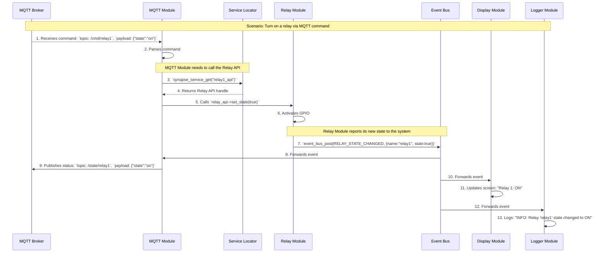

# კომუნიკაციის პატერნები (Communication Patterns)

## მიზანი

მოდულებს შორის კომუნიკაციის მიზანია უზრუნველყოს მაქსიმალური იზოლაცია, მოქნილობა და გაფართოებადობა, რათა სისტემის ნებისმიერი ნაწილი იყოს დამოუკიდებელი და მარტივად შესაცვლელი.

## ძირითადი პატერნები

### 1. Service Locator Pattern

- გამოიყენება კონკრეტული API-ს მისაღებად და პირდაპირი ფუნქციური გამოძახებისთვის
- უზრუნველყოფს მოდულებს შორის მინიმალურ დამოკიდებულებას
- მაგალითი:

  ```c
  service_handle_t display_service_handle = synapse_service_get("main_display");
  if (display_service_handle) {
      ssd1306_api_t *ssd1306_service_api = (ssd1306_api_t *)display_service_handle;
      ssd1306_service_api->enable();
  }
  ```

### 2. Event Bus Pattern

- გამოიყენება broadcast/notification სცენარებისთვის
- უზრუნველყოფს ერთზე მეტ მოდულთან ინფორმაციის გავრცელებას
- მაგალითი:

  ```c
  telemetry_data_t sensor_telemetry_data = {
      .temperature = 23.5,
      .humidity = 65.2
  };
  event_bus_post(TELEMETRY_EVENT_SENSOR_DATA, &sensor_telemetry_data);
  event_bus_subscribe(TELEMETRY_EVENT_SENSOR_DATA, mqtt_handle_sensor_data);
  event_bus_subscribe(TELEMETRY_EVENT_SENSOR_DATA, display_handle_sensor_data);
  ```

## სწორი გამოყენების წესები

- Service Locator გამოიყენეთ მხოლოდ კონკრეტული API-ს გამოძახებისთვის
- Event Bus გამოიყენეთ მხოლოდ broadcast ან notification სცენარებისთვის
- არასდროს გამოიყენოთ ორივე პატერნი ერთსა და იმავე მიზნისთვის
- აკრძალულია პირდაპირი #include სხვა მოდულის header-ების

## აკრძალული პრაქტიკები

❌ **არასდროს:**

- პირდაპირი დამოკიდებულება მოდულებს შორის
- Event Bus და Service Locator-ის არასწორი მიქსი
- System Manager-ის მიერ MQTT-ის პირდაპირი მართვა

## მაგალითები



### Service Locator

```c
// Display module API-ის გამოძახება
service_handle_t display_service_handle = synapse_service_get("main_display");
if (display_service_handle) {
    ssd1306_api_t *ssd1306_service_api = (ssd1306_api_t *)display_service_handle;
    ssd1306_service_api->disable();
}
```

### Event Bus

```c
// სენსორის მონაცემების გავრცელება
telemetry_data_t sensor_telemetry_data = {
    .temperature = 23.5,
    .humidity = 65.2
};
event_bus_post(TELEMETRY_EVENT_SENSOR_DATA, &sensor_telemetry_data);
```

---

შემდეგი ნაბიჯი: დეტალურად განვიხილოთ მოდულის სიცოცხლის ციკლი და ინიციალიზაციის პროცესი.
