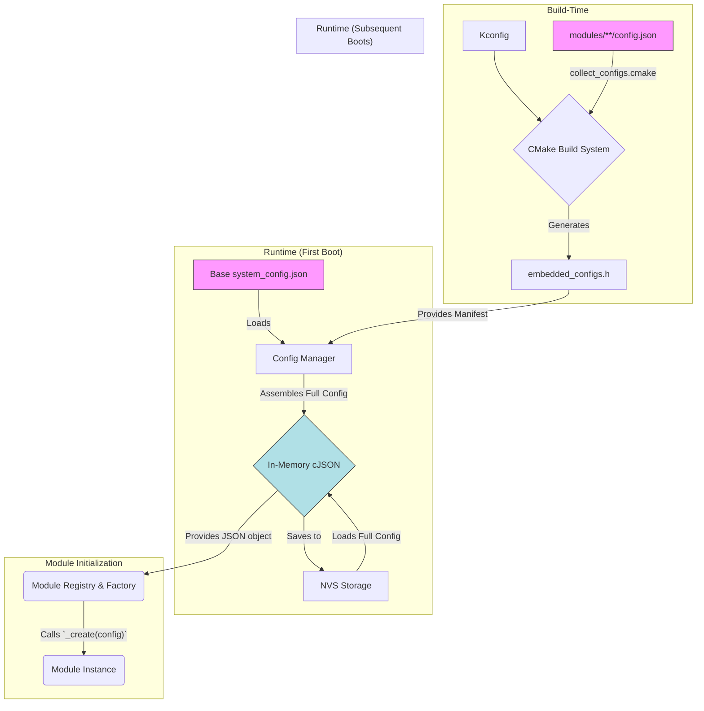

# კონფიგურაციის მართვის პროცესი (Configuration Flow)

## მიზანი

კონფიგურაციის მართვის მიზანია უზრუნველყოს მოდულების და სისტემის მოქნილი, სტანდარტიზებული და უსაფრთხო კონფიგურაცია, რომელიც ადვილად იკითხება, ვალიდირდება და გამოიყენება როგორც build-ის, ასევე runtime-ის დროს. Synapse Framework v5.0.0-დან იყენებს **დეცენტრალიზებულ** მოდელს, რაც აუმჯობესებს მოდულურობას და ხსნის 4KB NVS ლიმიტს.

## კონფიგურაციის წყაროები

**(განახლებულია)**

- **`Kconfig`:** განსაზღვრავს, რომელი მოდულების კოდი მოხვდება firmware-ში. ეს არის **build-დროის** კონფიგურაციის მთავარი წყარო.
- **`configs/system_config.json`:** ბაზისური კონფიგურაციის ფაილი. შეიცავს მხოლოდ გლობალურ პარამეტრებს (`firmware`, `global_config`) და ცარიელ `modules` მასივს.
- **`{module_name}/config.json`:** თითოეული მოდულის **default runtime კონფიგურაცია**. ეს ფაილი შეიცავს JSON ობიექტს ან ობიექტების მასივს, რომელიც აღწერს მოდულის ერთ ან მეტ ინსტანციას.
- **NVS (Non-Volatile Storage):** მუდმივი მეხსიერება, სადაც ინახება საბოლოო, "აწყობილი" კონფიგურაცია. სისტემა პირველ რიგში ცდილობს კონფიგურაციის წაკითხვას NVS-დან.

## კონფიგურაციის სტრუქტურა

**(განახლებულია)**

სისტემის მუშაობისას, `Config Manager` მეხსიერებაში აწყობს ერთიან cJSON ობიექტს, რომელიც ინარჩუნებს სტანდარტულ სტრუქტურას. ეს ობიექტი იქმნება `system_config.json`-ისა და ყველა აქტიური მოდულის `config.json`-ის გაერთიანებით.

```json
// მეხსიერებაში აწყობილი საბოლოო კონფიგურაციის მაგალითი
{
    "firmware": { ... },
    "global_config": { ... },
    "modules": [
        // ეს ობიექტი წამოღებულია relay_actuator/config.json-დან
        {
            "type": "relay_actuator",
            "enabled": true,
            "config": {
                "instance_name": "relay1",
                "pin": 23
            }
        },
        // ეს ობიექტი წამოღებულია wifi_manager/config.json-დან
        {
            "type": "wifi_manager",
            "enabled": true,
            "config": {
                "instance_name": "main_wifi"
            }
        }
    ]
}
```

## კონფიგურაციის დამუშავების ეტაპები

**(სრულად განახლებულია)**

1. **Build-დროის აღმოჩენა:**
    - `collect_configs.cmake` სკრიპტი პოულობს ყველა `config.json` ფაილს და ამატებს მათ firmware-ში უნიკალური სიმბოლოებით.
    - გენერირდება `embedded_configs.h` ფაილი, რომელიც შეიცავს ამ ჩაშენებული ფაილების "მანიფესტს".

2. **Runtime-ის ინიციალიზაცია (`synapse_config_manager_init`):**
    - **ნაბიჯი 1: NVS-ის შემოწმება.** `Config Manager` პირველ რიგში ცდილობს სრული კონფიგურაციის ჩატვირთვას NVS-დან.
    - **ნაბიჯი 2: Fallback (თუ NVS ცარიელია).** თუ NVS-ში კონფიგურაცია არ არის, იწყება "აწყობის" პროცესი:
        - იკითხება ბაზისური `configs/system_config.json`.
        - `embedded_configs.h`-ის გამოყენებით, ციკლში მუშავდება თითოეული მოდულის `config.json`.
        - მათი შიგთავსი ემატება ბაზისური კონფიგურაციის `modules` მასივში.
    - **ნაბიჯი 3: NVS-ში შენახვა.** "აწყობილი" სრული კონფიგურაცია ინახება NVS-ში, რათა შემდეგი ჩატვირთვა დაჩქარდეს.

3. **მოდულების ინიციალიზაცია:**
    - `Module Registry` იღებს სრულ, აწყობილ კონფიგურაციას.
    - `Module Factory` ქმნის თითოეულ მოდულს `config.json`-ში აღწერილი პარამეტრებით.



## კონფიგურაციის წვდომის მაგალითები

**(უცვლელია)**

```c
// სტრიქონის წაკითხვა (instance_name.key ფორმატით)
char broker_url[128];
esp_err_t ret = synapse_config_get_string("main_broker.broker_uri", broker_url, sizeof(broker_url));

// გლობალური პარამეტრის წაკითხვა
char device_prefix[32];
ret = synapse_config_get_string("global_config.device.id.prefix", device_prefix, sizeof(device_prefix));
```

## ვალიდაცია და Default მნიშვნელობები

- თითოეული მოდულის `_create` ფუნქცია პასუხისმგებელია თავისი კონფიგურაციის ვალიდაციაზე.
- არასწორი ან არარსებული მნიშვნელობების შემთხვევაში, მოდულმა უნდა გამოიყენოს `Kconfig`-ში განსაზღვრული ან კოდში მითითებული default მნიშვნელობები.
- ყველა შეცდომა ლოგირდება.

## Runtime Reconfiguration

**(უცვლელია)**

- შესაძლებელია მოდულის კონფიგურაციის განახლება მუშაობის დროს.
- გამოიყენება სპეციალური API: `synapse_module_reconfigure(const char *module_name, const cJSON *new_config)`.
- ცვლილებები ინერგება მხოლოდ ვალიდაციის შემდეგ და ინახება NVS-ში.

## აკრძალული და რეკომენდებული პრაქტიკები

❌ **არასდროს:**

- Hardcoded მნიშვნელობები კოდში.
- კონფიგურაციის პირდაპირი წვდომა სხვა მოდულიდან.
- `module.json`-ში runtime პარამეტრების შენახვა.

✅ **ყოველთვის:**

- გამოიყენეთ `synapse_config_get_*` API-ები.
- განსაზღვრეთ default მნიშვნელობები `Kconfig`-ში.
- დაიცავით `config.json`-ის სტანდარტული სტრუქტურა.

---

შემდეგი ნაბიჯი: დეტალურად განვიხილოთ კომუნიკაციის პატერნები და მათი გამოყენების წესები.
