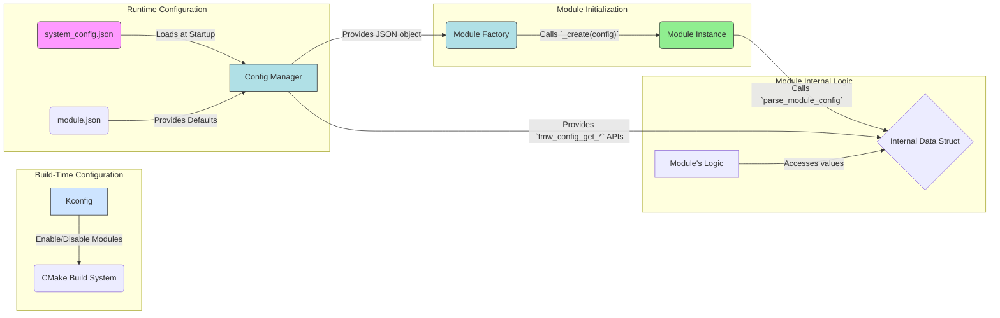

# კონფიგურაციის მართვის პროცესი (Configuration Flow)

## მიზანი

კონფიგურაციის მართვის მიზანია უზრუნველყოს მოდულების და სისტემის მოქნილი, სტანდარტიზებული და უსაფრთხო კონფიგურაცია, რომელიც ადვილად იკითხება, ვალიდირდება და გამოიყენება როგორც ბილდის, ასევე runtime-ის დროს.

## კონფიგურაციის წყაროები

- **system_config.json** — მთავარი კონფიგურაციის ფაილი, სადაც აღწერილია ყველა მოდული, მათი პარამეტრები და გლობალური პარამეტრები.
- **module.json** — თითოეული მოდულის აღწერითი და default კონფიგურაცია.
- **Kconfig** — ბილდის დროის კონფიგურაციის პარამეტრები (enable/disable მოდულები).

## კონფიგურაციის სტრუქტურა

```json
{
    "firmware": { ... },
    "global_config": { ... },
    "modules": [
        {
            "type": "relay_module",
            "enabled": true,
            "config": {
                "instance_name": "relay1",
                "pin": 23
            }
        },
        ...
    ]
}
```

## კონფიგურაციის დამუშავების ეტაპები

1. **კონფიგურაციის წაკითხვა**
   - system_config.json იკითხება startup-ზე
   - თითოეული მოდულის ჩანაწერი ინახება მოდულების რეესტრში
2. **ვალიდაცია**
   - ყველა აუცილებელი პარამეტრი მოწმდება (type, instance_name, აუცილებელი ველები)
   - არასწორი ან არასრული ჩანაწერები გამოითიშება ან ლოგდება
3. **მოდულების ინიციალიზაცია**
   - Module Factory ქმნის თითოეულ მოდულს შესაბამისი create ფუნქციით
   - კონფიგურაცია გადაეცემა მოდულის constructor-ში
4. **Runtime ცვლილებები**
   - შესაძლებელია კონფიგურაციის განახლება (reconfigure) სპეციალური API-ით
   - ცვლილებები ვალიდირდება და ინერგება მოდულში



## კონფიგურაციის წვდომის მაგალითები

```c
// სტრიქონის წაკითხვა
char broker_url[128];
esp_err_t ret = fmw_config_get_string("mqtt_module.config.broker_uri", broker_url, sizeof(broker_url));

// მთელი მოდულის კონფიგურაციის წაკითხვა
const cJSON *relay_config = fmw_config_get_module_config("relay1");

// გლობალური პარამეტრის წაკითხვა
char device_prefix[32];
ret = fmw_config_get_string("global_config.device.id.prefix", device_prefix, sizeof(device_prefix));
```

## ვალიდაცია და Default მნიშვნელობები

- ყველა მოდული ვალიდაციას გადის parse_module_config ფუნქციაში
- არასწორი ან არარსებული მნიშვნელობების შემთხვევაში გამოიყენება default მნიშვნელობები
- ყველა შეცდომა ლოგირდება

## Runtime Reconfiguration

- შესაძლებელია მოდულის კონფიგურაციის განახლება მუშაობის დროს
- გამოიყენება სპეციალური API: `module_reconfigure(module_t *module, const cJSON *new_config)`
- ცვლილებები ინერგება მხოლოდ ვალიდაციის შემდეგ

## აკრძალული და რეკომენდებული პრაქტიკები

❌ **არასდროს:**
- Hardcoded მნიშვნელობები კოდში
- კონფიგურაციის პირდაპირი წვდომა სხვა მოდულიდან
- არასტანდარტული სტრუქტურა

✅ **ყოველთვის:**
- გამოიყენეთ fmw_config_get_* API-ები
- დაიცავით სტანდარტული სტრუქტურა
- ჩაწერეთ ყველა ცვლილება ლოგში

---

შემდეგი ნაბიჯი: დეტალურად განვიხილოთ კომუნიკაციის პატერნები და მათი გამოყენების წესები.

