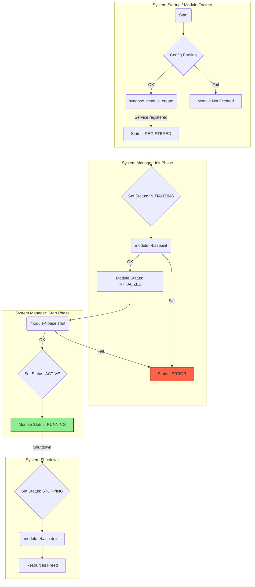

# მოდულის სიცოცხლის ციკლი და ინიციალიზაცია (v2.0)

## მიზანი

მოდულის სიცოცხლის ციკლის მართვის მიზანია უზრუნველყოს თითოეული მოდულის (და მასთან დაკავშირებული სერვისის) სწორი ინიციალიზაცია, რესურსების გამოყოფა, გააქტიურება და უსაფრთხო გათავისუფლება.

## სიცოცხლის ციკლის ეტაპები და სერვისის სტატუსები

1. **Create** (`_create` ფუნქცია)
    - `System Manager`-ის მიერ `Module Factory`-ს გამოძახება.
    - მეხსიერების გამოყოფა, კონფიგურაციის დუბლირება.
    - **სერვისის რეგისტრაცია `SERVICE_STATUS_REGISTERED` სტატუსით.**

2. **Init** (`_init` ფუნქცია)
    - `System Manager` ცვლის სერვისის სტატუსს `SERVICE_STATUS_INITIALIZING`-ზე.
    - ხდება რესურსების დაკავება, `Dependency Injection`-ით მიღებული `handle`-ების ვალიდაცია, ივენთებზე გამოწერა.
    - წარმატების შემთხვევაში, მოდულის სტატუსი ხდება `MODULE_STATUS_INITIALIZED`.

3. **Start** (`_start` ფუნქცია)
    - `System Manager`-ის მიერ გამოძახება.
    - აქტიური ოპერაციების დაწყება (მაგ., ტასკის გაშვება).
    - წარმატების შემთხვევაში, მოდულის სტატუსი ხდება `MODULE_STATUS_RUNNING` და `System Manager` ცვლის სერვისის სტატუსს **`SERVICE_STATUS_ACTIVE`**-ზე.

4. **Deinit** (`_deinit` ფუნქცია)
    - `System Manager` (Graceful Shutdown-ისას) ცვლის სერვისის სტატუსს `SERVICE_STATUS_STOPPING`-ზე.
    - ხდება ყველა რესურსის (მეხსიერება, `mutex`-ები, ივენთების გამოწერები, სერვისის რეგისტრაცია) გათავისუფლება.

## სიცოცხლის ციკლის დიაგრამა (განახლებული)



## მაგალითი მოდულის სიცოცხლის ციკლის მართვის

```c
module_t *ssd1306_module_create(const cJSON *config) {
    // ... კონფიგურაციის დამუშავება ...
    ssd1306_private_data_t *ssd1306_data = malloc(sizeof(ssd1306_private_data_t));
    // ... პარამეტრების ინიციალიზაცია ...
    ssd1306_init(module);
    return module;
}

static esp_err_t ssd1306_init(module_t *module) {
    // ... hardware init ...
    return ESP_OK;
}

static esp_err_t ssd1306_enable(module_t *module) {
    // ... enable logic ...
    return ESP_OK;
}

static esp_err_t ssd1306_disable(module_t *module) {
    // ... disable logic ...
    return ESP_OK;
}

static esp_err_t ssd1306_deinit(module_t *module) {
    // ... free resources ...
    return ESP_OK;
}
```

## აკრძალული და რეკომენდებული პრაქტიკები

❌ **არასდროს:**

- რესურსების გამოუყენებლად დატოვება
- არასტანდარტული სახელების გამოყენება
- სიცოცხლის ციკლის ეტაპების გამოტოვება

✅ **ყოველთვის:**

- დაიცავით სტანდარტული სახელები და სტრუქტურა
- გაათავისუფლეთ ყველა გამოყოფილი რესურსი
- გამოიყენეთ დეტალური ლოგირება თითოეულ ეტაპზე

---

შემდეგი ნაბიჯი: დეტალურად განვიხილოთ შეცდომების დამუშავების და ლოგირების სტანდარტები.
