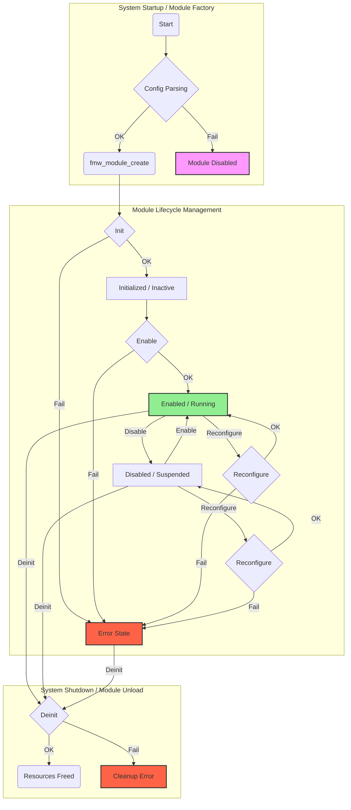

# მოდულის სიცოცხლის ციკლი და ინიციალიზაცია (Lifecycle & Initialization)

## მიზანი

მოდულის სიცოცხლის ციკლის მართვის მიზანია უზრუნველყოს თითოეული მოდულის სწორი ინიციალიზაცია, რესურსების გამოყოფა, ჩართვა/გამორთვა და უსაფრთხო გათავისუფლება სისტემის მუშაობის განმავლობაში.

## სიცოცხლის ციკლის ეტაპები

1. **Create** — მოდულის ობიექტის შექმნა (მაგ: ssd1306_module_create)
2. **Init** — ინიციალიზაცია (მაგ: static esp_err_t ssd1306_init)
3. **Enable/Disable** — ჩართვა/გამორთვა (მაგ: static esp_err_t ssd1306_enable/disable)
4. **Deinit** — რესურსების გათავისუფლება (მაგ: static esp_err_t ssd1306_deinit)

## დეტალური აღწერა

### 1. Create

- ხდება მოდულის ობიექტის შექმნა და კონფიგურაციის გადაცემა
- გამოიყენება Factory-ის მიერ
- მაგალითი:

  ```c
  module_t *ssd1306_module_create(const cJSON *config);
  ```

### 2. Init

- ხდება hardware-ის ან სხვა რესურსების ინიციალიზაცია
- ყველა აუცილებელი პარამეტრი მოწმდება და ინახება
- მაგალითი:

  ```c
  static esp_err_t ssd1306_init(module_t *module);
  ```

### 3. Enable/Disable

- უზრუნველყოფს მოდულის აქტივაციას ან დროებით გათიშვას
- გამოიყენება სისტემის ან მომხმარებლის მიერ
- მაგალითი:

  ```c
  static esp_err_t ssd1306_enable(module_t *module);
  static esp_err_t ssd1306_disable(module_t *module);
  ```

### 4. Deinit

- ხდება ყველა გამოყოფილი რესურსის გათავისუფლება
- გამოიყენება სისტემის გათიშვის ან მოდულის ამოღებისას
- მაგალითი:

  ```c
  static esp_err_t ssd1306_deinit(module_t *module);
  ```

## სიცოცხლის ციკლის დიაგრამა



## მაგალითი მოდულის სიცოცხლის ციკლის მართვის

```c
module_t *ssd1306_module_create(const cJSON *config) {
    // ... კონფიგურაციის დამუშავება ...
    ssd1306_private_data_t *ssd1306_data = malloc(sizeof(ssd1306_private_data_t));
    // ... პარამეტრების ინიციალიზაცია ...
    ssd1306_init(module);
    return module;
}

static esp_err_t ssd1306_init(module_t *module) {
    // ... hardware init ...
    return ESP_OK;
}

static esp_err_t ssd1306_enable(module_t *module) {
    // ... enable logic ...
    return ESP_OK;
}

static esp_err_t ssd1306_disable(module_t *module) {
    // ... disable logic ...
    return ESP_OK;
}

static esp_err_t ssd1306_deinit(module_t *module) {
    // ... free resources ...
    return ESP_OK;
}
```

## აკრძალული და რეკომენდებული პრაქტიკები

❌ **არასდროს:**

- რესურსების გამოუყენებლად დატოვება
- არასტანდარტული სახელების გამოყენება
- სიცოცხლის ციკლის ეტაპების გამოტოვება

✅ **ყოველთვის:**

- დაიცავით სტანდარტული სახელები და სტრუქტურა
- გაათავისუფლეთ ყველა გამოყოფილი რესურსი
- გამოიყენეთ დეტალური ლოგირება თითოეულ ეტაპზე

---

შემდეგი ნაბიჯი: დეტალურად განვიხილოთ შეცდომების დამუშავების და ლოგირების სტანდარტები.
